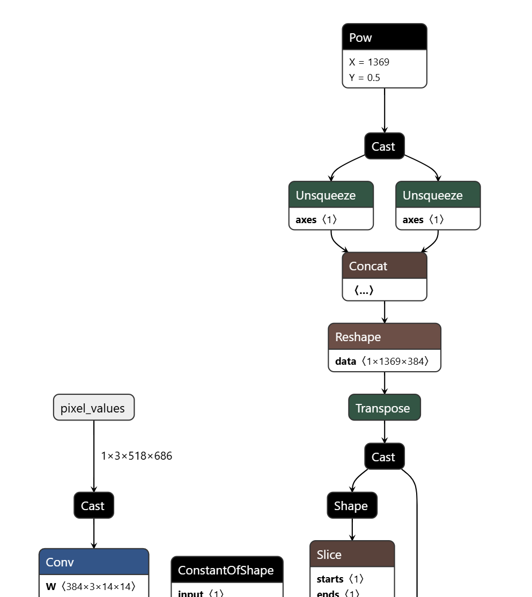
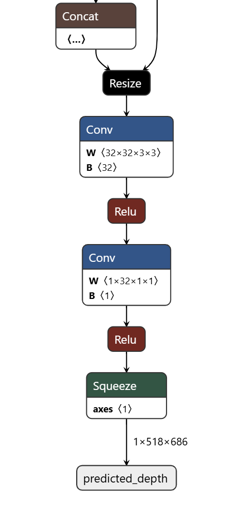
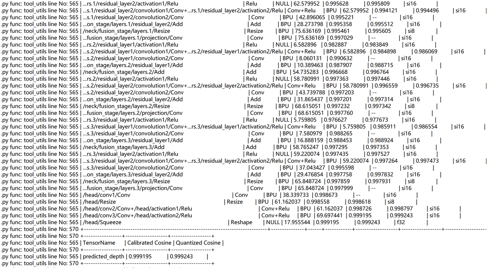
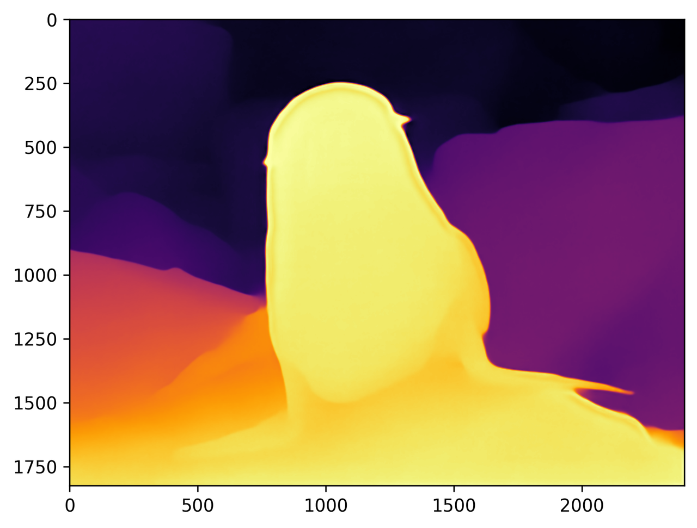
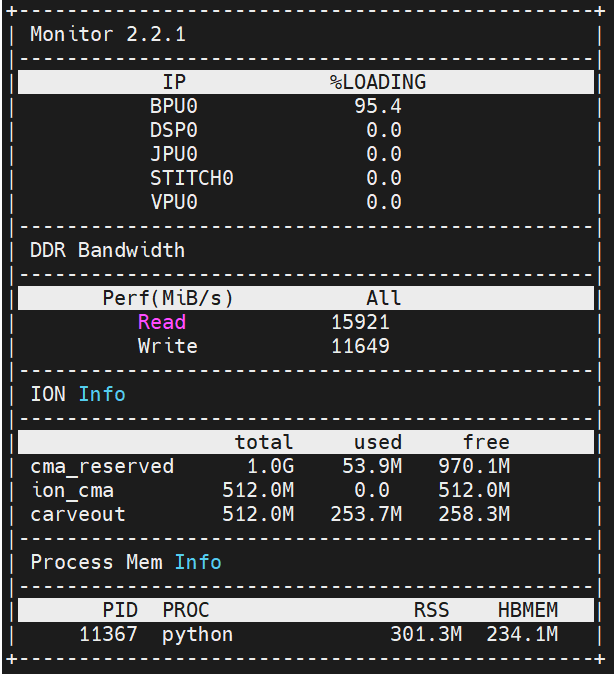

# 1. Background Introduction&#x20;

## 1.1 Model Overview

Depth Anything is a highly practical monocular depth estimation solution. Without pursuing novel technical modules, this project aims to build a simple yet powerful foundation model capable of handling arbitrary images in any situation. Its framework is as follows, using a standard process to unleash the potential of large-scale unlabeled images.


More details about the model can be found on the project webpage, in the paper, and in the official code repository.&#x20;

Project Website:https://depth-anything.github.io/

Paper:https://arxiv.org/abs/2406.19675

Code Repository:https://github.com/DepthAnything/Depth-Anything-V2

Depth Anything V2 is an improved version of Depth Anything V1. Notably, compared to V1, this version generates more refined and robust depth predictions through three key practices: replacing all labeled real images with synthetic images, increasing the capacity of the teacher model, and bridging and training the student model with large-scale pseudo-labeled real images. More details about the model can be found on the project webpage, in the paper, and in the official code repository.


## 1.2 ONNX Model

Observing this ONNX model, it only accepts one input and one output. The input is an image with dimensions 1x3x518x686, and the output is the predicted depth map with dimensions 1x518x686.&#x20;





The model includes most operators being conventional operators such as Add, Conv, Mul, MatMul, etc. However, since it includes a part of the attention mechanism of the transformer, it also includes quantization-unfriendly operators such as Softmax.&#x20;


# 2. Quantization Precision

We used the RDK S100 toolchain to perform model conversion on this ONNX model, carried out int16 quantization, and obtained the following results&#x20;



It can be seen that the quantization accuracy of most operators is greater than 0.99, and the final quantization accuracy is \~0.999


# 3. RDK S100 Model Deployment&#x20;


## 3.1 Performance of the model's upper board

After completing the steps of the toolchain, we obtain a model in.hbm format, which is a heterogeneous model that can be deployed on the RDK S100 and supports the use of BPU computing power.&#x20;

We use the hrt\_model\_exec tool to perform model performance testing.

```plain&#x20;text
hrt_model_exec perf --model_file depth_any.hbm --frame_count 100 --thread_num 1
```

We use the parameter thread\_num to adjust the number of threads and obtain different results

Finally, the following table is obtained:

| Number of threads | Total frame number | Total delay (ms) | Average Delay (ms)  | FPS  |
| ----------------- | ------------------ | ---------------- | ------------------- | ---- |
| 1                 | 100                | 13738.43         | 137.38              | 7.27 |
| 2                 | 100                | 26375.53         | 263.74              | 7.54 |
| 4                 | 100                | 52214.07         | 521.90              | 7.54 |
| 8                 | 100                | 102309.64        | 1020.35             | 7.54 |


## 3.2 Model Upper Plate Precision

We tested the.hbm model, and we selected an image to output a depth map.&#x20;


After performing inference using the.hbm model, the following depth map is obtained:&#x20;



The inference results are consistent with those of the CPU model&#x20;


## 3.3 Other Indicators

We use the command:

```plain&#x20;text
hrt_ucp_monitor
```

Obtain other indicators&#x20;



BPU Occupancy: 95.4%

ION Memory Usage: \~300M

Bandwidth Read: \~15920

Bandwidth Write: \~11650


## 3.4 Detailed Explanation of Model Upper Plate Operation

To experience this model, please refer to the README of the Model Zoo of RDK S100 before operating the model

Download and install hbm\_runtime on the RDK S100 board,&#x20;

Next, we install the corresponding dependencies:

```plain&#x20;text
pip install -r requirements.txt
```

After completing the installation of relevant dependencies, we can execute&#x20;

```plain&#x20;text
python main.py
```

Obtain the above depth map.&#x20;

You can also replace the image path in main.py with another image for testing.&#x20;
