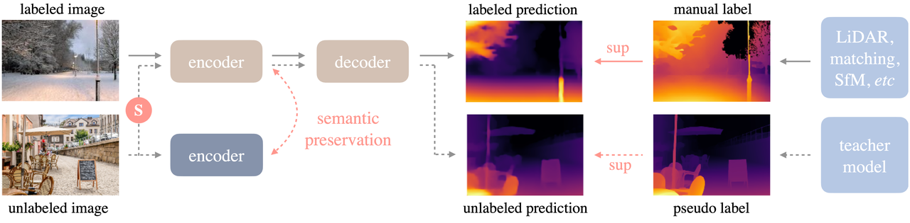
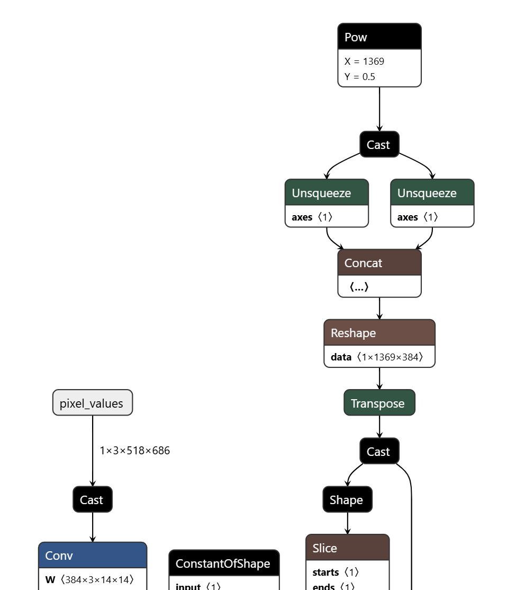
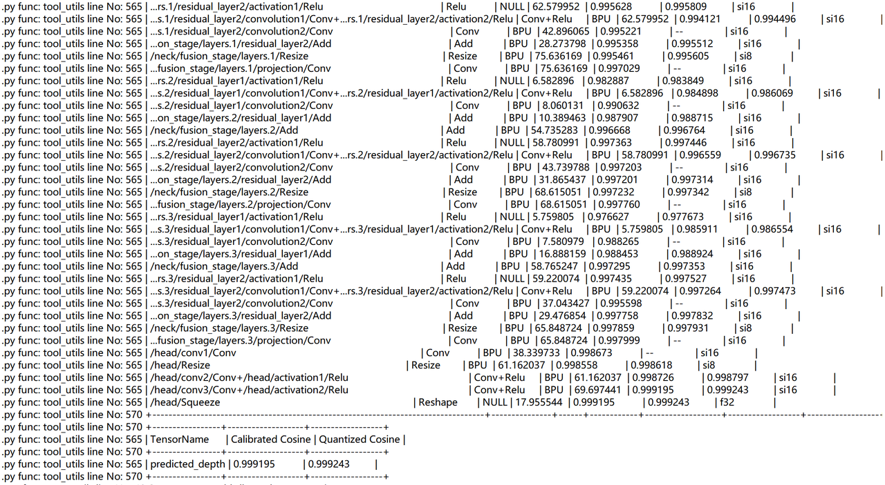
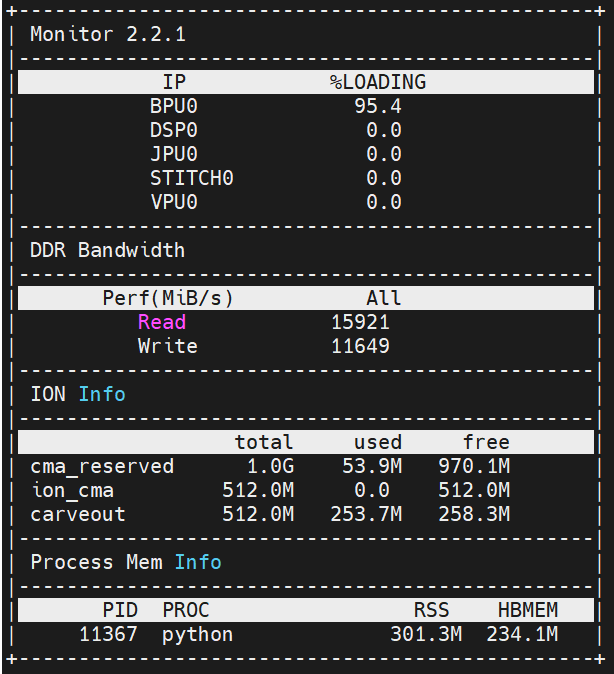

# 1. 背景介绍

## 1.1 模型概况

Depth Anything 是一种高度实用的单目深度估计解决方案。在不追求新颖技术模块的前提下，该项目旨在构建一个简单而强大的基础模型，能够处理任何情况下的任意图像。其框架如下所示，采用标准流程来释放大规模无标签图像的潜力。



更多关于模型的细节可以在项目网页、论文和官方代码库中找到。

项目网页：https://depth-anything.github.io/

论文：https://arxiv.org/abs/2406.19675

代码仓：https://github.com/DepthAnything/Depth-Anything-V2

Depth Anything V2 是 Depth Anything V1 的改进版。值得注意的是，与 V1 相比，这一版本通过三项关键实践生成了更加精细且更稳健的深度预测：用合成图像替换所有标注过的真实图像、提升教师模型的容量，以及通过大规模伪标注的真实图像来桥接并训练学生模型。更多关于模型的细节可以在项目网页、论文和官方代码库中找到。


## 1.2 ONNX模型

观察该onnx模型，该onnx仅接受一个输入和一个输出。输入为一张图像，尺寸为1x3x518x686。输出为预测的深度图，尺寸为1x518x686&#x20;




该模型包括大部分算子为Add、Conv、Mul、MatMul等常规算子，但由于其包含一部分transformer的注意力机制，因此其中也包括Softmax等量化不友好算子。


# 2. 量化精度

我们使用RDK S100工具链对该ONNX模型进行模型转换，进行int16量化，得到如下结果



可以看到大部分算子量化精度均大于0.99，最终量化精度\~0.999


# 3. RDK S100模型部署


## 3.1 模型上板性能

在完成工具链的步骤后，我们得到.hbm格式的模型，该格式为可以在RDK S100上部署的异构模型，支持使用BPU算力。

我们使用hrt\_model\_exec工具进行模型性能测试。

```plain&#x20;text
hrt_model_exec perf --model_file depth_any.hbm --frame_count 100 --thread_num 1
```

我们使用参数thread\_num来调整线程数，得到不同的结果

最终得到如下表格：

| 线程数 | 总帧数 | 总时延（ms）   | 平均时延（ms） | FPS  |
| --- | --- | --------- | -------- | ---- |
| 1   | 100 | 13738.43  | 137.38   | 7.27 |
| 2   | 100 | 26375.53  | 263.74   | 7.54 |
| 4   | 100 | 52214.07  | 521.90   | 7.54 |
| 8   | 100 | 102309.64 | 1020.35  | 7.54 |


## 3.2 模型上板精度

我们对.hbm模型进行测试，我们选取一张图片进行深度图的输出。


使用.hbm模型进行推理后，得到如下深度图：


该推理结果与CPU模型推理结果保持一致


## 3.3 其他指标

我们使用命令：

```plain&#x20;text
hrt_ucp_monitor
```

得到其他指标



BPU占用率：95.4%

ION内存占用：\~300M

带宽读：\~15920

带宽写：\~11650


## 3.4 模型上板操作详解

为了体验该模型，在操作该模型前，请参考RDK S100的Model Zoo的README

在RDK S100板卡上下载并安装hbm\_runtime，

随后，我们安装对应的依赖：

```plain&#x20;text
pip install -r requirements.txt
```

在完成相关依赖的安装后，我们下载模型：

```
wget https://archive.d-robotics.cc/downloads/rdk_model_zoo/rdk_s100/depth_any/depth_any.hbm
```

随后可以执行

```plain&#x20;text
python main.py
```

得到以上的深度图。

也可以自行替换main.py中的图片路径，更改为其他图片进行测试。
